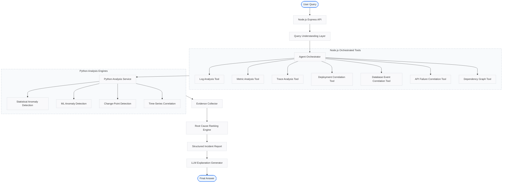

# System Architecture

This document describes the high-level architecture, technology stack, service responsibilities, design principles, and LLM usage policies of the Incident Root Cause Analysis (RCA) system.

---

## High-Level Architecture

The system processes a user's incident query through a pipeline of query understanding, tool orchestration, statistical/ML analysis, root cause ranking, and explanation generation.

---

## Technology Stack

The application is structured as a split-responsibility system combining a TypeScript/Node.js orchestration backend with a high-performance Python analysis service.

| Component | Technology | Purpose / Notes |
| :--- | :--- | :--- |
| **Node.js Backend** | Node.js, Express, TypeScript | API gateway, orchestration, data storage, tool management |
| | Zod | Schema validation |
| | SQLite / PostgreSQL | Database storage (SQLite for development, Postgres for production) |
| | Axios / Fetch | API communication with Python service |
| **Python Analysis Service**| Python, FastAPI, Pydantic | High-performance numeric anomaly & correlation APIs |
| | Pandas, NumPy | Data manipulation and processing |
| | Scikit-learn | Machine learning anomaly detection algorithms |
| | Ruptures | Change-point detection in time-series data |
| **LLM Orchestration** | LLM API (Gemini/GPT) | Query understanding, tool selection, report natural language explanation |
| **Data Layer** | Synthetic Telemetry Data | Logs, metrics, traces, deployment events, database events, API failures |

---

## Service Responsibilities

### 🟢 Node.js Backend
The Node.js backend serves as the coordinator and data layer of the application.

*   **API & Ingestion:** Exposes public endpoints, ingests raw logs, metrics, traces, deployment events, database events, and API failure events, and handles storage.
*   **Log & Event Analysis:** Executes log grouping, deployment proximity correlation, database events, and API failure analysis.
*   **Orchestration & Workflow:** Calls the LLM to understand queries, invokes necessary tools, collects evidence, and runs the ranking algorithm.
*   **Report Generation:** Builds the final structured report and invokes the LLM to format the natural-language explanation.

### 🟡 Python Analysis Service
The Python service acts as a dedicated mathematical and statistical computation engine.

*   **Metric Preprocessing:** Standardizes and prepares metrics for mathematical analysis.
*   **Statistical Anomalies:** Computes metric deviations using statistical methods (e.g., Z-score, IQR).
*   **ML-Based Anomalies:** Runs machine learning models (e.g., Isolation Forest, One-Class SVM) to detect complex multi-dimensional anomalies.
*   **Time-Series Processing:** Finds change-points and performs cross-correlation across different metric time-series to identify propagation patterns.

---

## Design Principles

Our architecture adheres to strict engineering boundaries to ensure reliability, explainability, and speed:

1.  **Deterministic Evidence:** Individual tools produce structured, deterministic evidence based on concrete rules and math.
2.  **Algorithm-Based Root Cause:** The root cause is calculated and ranked using a structured ranking engine rather than LLM intuition.
3.  **Explainability:** Every root cause suggestion must point to specific, human-verifiable evidence logs or metric anomalies.
4.  **No Telemetry Dumping:** The LLM is never fed raw telemetry data (e.g., thousands of log lines or raw metric vectors) to avoid hallucinations and excessive token usage.
5.  **Easy-to-Explain System:** The flow uses standard software design patterns (Orchestrator, Tools, Analysis Engines, Ranking) that are clean, modular, and easy to explain.

---

## LLM Usage Policy

To maintain deterministic reliability, the LLM is restricted to semantic reasoning tasks.

### ✅ What the LLM IS Used For
*   **Query Intent Extraction:** Parsing free-text user queries into structured search targets (e.g., service name, timeframe, metric type).
*   **Tool Selection / Routing:** Helping the orchestrator select the most relevant analysis tools based on the user's intent.
*   **Synthesizing Explanations:** Translating the final structured JSON report and ranking evidence into natural language explanations.

### ❌ What the LLM IS NOT Used For
*   **Direct Anomaly Detection:** Looking at raw data vectors to guess if a spike is abnormal.
*   **Raw Data Reading:** Ingesting raw logs or stack traces directly.
*   **Guessing Root Causes:** Speculating or determining the root cause without evidence.
*   **Inventing Missing Telemetry:** Creating dummy artifacts or filling gaps when evidence is missing.
